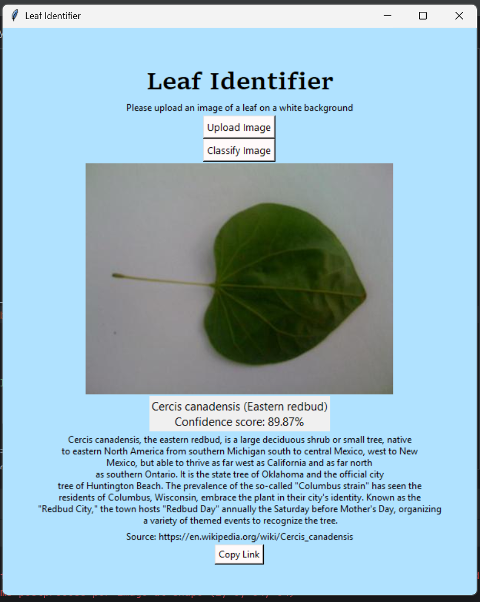

# Leaf Identifier

A Python application with a graphical user interface that uses YOLOv8 AI models to identify tree species from leaf images with exceptional accuracy.

## Overview

Leaf Identifier is an intuitive desktop application that analyzes photographs of leaves and determines which tree species they belong to. Built with a user-friendly Tkinter interface, the application leverages state-of-the-art YOLOv8 deep learning models to provide accurate tree identification along with comprehensive Wikipedia-sourced descriptions of each species.


*Example: Eastern redbud leaf identified with 89.87% confidence*

## Features

- **High Accuracy**: Achieves up to 99.85% confidence scores in tree species identification
- **Extensive Database**: Recognizes up to 185 different tree species
- **User-Friendly GUI**: Simple point-and-click interface built with Tkinter
- **Detailed Information**: Displays comprehensive descriptions sourced from Wikipedia
- **Direct Wikipedia Links**: Provides clickable links to Wikipedia articles for further reading
- **One-Click Copy**: Easily copy Wikipedia source links to your clipboard
- **Smart Image Handling**: Automatically resizes large images for optimal display
- **YOLOv8 Powered**: Built on the latest YOLOv8 architecture for optimal performance

## Requirements

- Python 3.8 or higher
- tkinter (usually included with Python)
- Pillow (PIL)
- YOLOv8 (ultralytics)
- pandas
- pyperclip
- wikipedia-api or similar library for fetching summaries

## Installation

1. Clone this repository:
```bash
git clone <repository-url>
cd leaf_identifier
```

2. Install required dependencies:
```bash
pip install -r requirements.txt
```

3. Ensure the following files are present:
   - Trained YOLOv8 model file
   - `leaves.csv` (species data with alternate names)
   - `insert_img_icon.png` (default placeholder image)

## Usage

To launch the Leaf Identifier application:

```bash
python main.py
```

### How to Use

1. **Launch the Application**: Run `main.py` to open the GUI window
2. **Upload an Image**: Click the "Upload Image" button and select a JPG or JPEG file of a leaf photographed on a white background
3. **Classify**: Click the "Classify Image" button to identify the tree species
4. **View Results**: The application will display:
   - The uploaded leaf image (auto-resized if needed)
   - Scientific name and common name of the tree
   - Confidence score of the prediction
   - Detailed Wikipedia description of the tree species
   - Source link to the Wikipedia article
5. **Copy Link**: Click "Copy Link" to copy the Wikipedia URL to your clipboard

### Best Practices for Leaf Photos

- Use a **white background** for best results
- Ensure the leaf is well-lit and in focus
- Photograph the leaf flat with visible details
- Include the entire leaf in the frame
- Use JPG or JPEG format

### Example Output

```
Cercis canadensis (Eastern redbud)
Confidence score: 89.87%

Cercis canadensis, the eastern redbud, is a large deciduous shrub or small tree, 
native to eastern North America from southern Michigan south to central Mexico, 
west to New Mexico, but able to thrive as far west as California and as far north 
as southern Ontario...

Source: https://en.wikipedia.org/wiki/Cercis_canadensis
```

## Model Performance

The YOLOv8 model has been trained on a comprehensive dataset of leaf images and achieves:

- Maximum confidence score: 99.85%
- Species coverage: 185 tree species
- Optimized for leaves photographed on white backgrounds
- Handles alternate/updated scientific names via `leaves.csv`

## Technical Details

- **GUI Framework**: Tkinter with custom styling (light blue theme)
- **Image Processing**: PIL/Pillow for image handling and resizing
- **Model**: YOLOv8 for image classification
- **Data Source**: Wikipedia API for species descriptions
- **Species Database**: CSV file maintains alternate nomenclature

## Credits

**Developer**: Tavishi Bhatia  
**Date**: May 14, 2024

## Acknowledgments

- Built with [Ultralytics YOLOv8](https://github.com/ultralytics/ultralytics)
- Tree descriptions sourced from [Wikipedia](https://www.wikipedia.org/)
- Thanks to all contributors and the open-source community

## Contributing

Contributions are welcome! Please feel free to submit pull requests or open issues for bugs and feature requests.

## License

This project is licensed under the MIT License - see the LICENSE file for details.

## Support

For questions or support, please open an issue in the repository.
